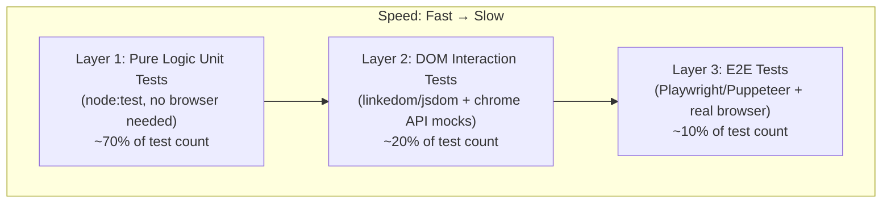

# How to Reliably Test Browser Extensions That Interact with SPAs and Page-Generated Menus

## Executive Summary

Testing browser extensions that inject content into Single Page Applications and modify page-generated menus is a multi-layer problem requiring fundamentally different strategies at each level. The research — drawn from 30+ real-world extension repositories including MetaMask, Privacy Badger, and Bitwarden — reveals a clear industry consensus: **separate your code into Chrome-free pure logic (tested with Node.js), DOM interaction logic (tested with jsdom/linkedom), and end-to-end flows (tested with Playwright or Puppeteer loading the real extension into a real browser)**. Never test against live third-party sites; always use local mock pages. The highest-leverage architectural decision is extracting pure functions from content script IIFEs so they can be tested without any browser at all.

---

## Table of Contents

1. [Testing Architecture Overview](#1-testing-architecture-overview)
2. [Layer 1: Unit Testing Pure Logic](#2-layer-1-unit-testing-pure-logic)
3. [Layer 2: DOM Interaction Testing](#3-layer-2-dom-interaction-testing)
4. [Layer 3: E2E Testing with Real Browsers](#4-layer-3-e2e-testing-with-real-browsers)
5. [Testing SPA-Specific Challenges](#5-testing-spa-specific-challenges)
6. [Testing Context Menu Injection](#6-testing-context-menu-injection)
7. [Testing Fetch Interception & postMessage](#7-testing-fetch-interception--postmessage)
8. [Mock Pages & Network Mocking](#8-mock-pages--network-mocking)
9. [Cross-Browser Testing](#9-cross-browser-testing)
10. [CI/CD Integration](#10-cicd-integration)
11. [Flaky Test Mitigation](#11-flaky-test-mitigation)
12. [Recommended Test Organization](#12-recommended-test-organization)
13. [Key Repositories & Tools](#13-key-repositories--tools)
14. [Confidence Assessment](#14-confidence-assessment)

---

## 1. Testing Architecture Overview

### The Extension Testing Pyramid



Every production extension studied uses a variant of this three-layer strategy[^1]. The key insight: **the more logic you can extract into browser-free pure functions, the faster and more reliable your test suite becomes**.

### Framework Comparison

| Framework | Best For | MV3 Support | Firefox | Headless | Content Script Testing |
|-----------|----------|-------------|---------|----------|----------------------|
| **Playwright** | E2E (recommended) | ✅ Full | ❌ No extension support | ✅ via `channel: 'chromium'` | `page.evaluate()` in MAIN world |
| **Puppeteer v23+** | E2E (alternative) | ✅ Full | ❌ | ✅ `headless: 'new'` | `extensionRealms()` for ISOLATED world |
| **Selenium/WebdriverIO** | Cross-browser E2E | ✅ | ✅ via `installAddOn()` | ⚠️ Needs xvfb | `executeScript()` in page context |
| **Node.js test runner** | Unit tests | N/A | N/A | N/A | Import pure functions directly |
| **Jest/Vitest + jsdom** | DOM + chrome mock | N/A | N/A | N/A | Full DOM simulation |

All E2E frameworks are Chromium-only for extension testing. Firefox requires WebdriverIO with `browser.installAddOn()`[^2].

---

## 2. Layer 1: Unit Testing Pure Logic

### The Chrome-Free Core Pattern

The highest-leverage architectural decision: separate Chrome-API-free logic into pure modules[^3].

```
src/
├── shared/              ← Chrome-free, side-effect-free. 100% testable.
│   ├── autocomplete.js
│   ├── constants.js
│   └── archidekt-page.js
├── content.js           ← DOM + chrome.*, uses shared/
├── background.js        ← chrome.*, wraps shared/
└── page_hook.js         ← MAIN world, intercepts fetch
```

Pure functions need **no mocking whatsoever** — just import and test:

```js
// tests/autocomplete.test.js — runs in <1 second
import { describe, it } from 'node:test';
import assert from 'node:assert/strict';
import { filterTags } from '../src/shared/autocomplete.js';

describe('filterTags', () => {
  it('matches partial tag names case-insensitively', () => {
    const tags = ['creature', 'enchantment', 'instant'];
    assert.deepEqual(filterTags(tags, 'enc'), ['enchantment']);
  });
});
```

### Testing Background Script Logic with `vm.createContext`

For files with Chrome API dependencies that can't be easily refactored, use Node's `vm` module to load them into a sandboxed context with mock Chrome APIs[^4]:

```js
const vm = require('node:vm');
const fs = require('node:fs');

const code = fs.readFileSync('./src/background.js', 'utf8');
const chrome = {
  runtime: { onMessage: { addListener: (fn) => { messageHandler = fn; } } },
  storage: { local: { get: async (keys) => mockStorage } },
};
const sandbox = { chrome, console, setTimeout, fetch: mockFetch };
vm.createContext(sandbox);
vm.runInContext(code, sandbox);
```

### Mocking Chrome APIs for Unit Tests

For projects using Jest or Vitest, a comprehensive Chrome API mock replaces all browser dependencies[^5]:

```typescript
// test/setup.ts (Vitest example)
vi.stubGlobal('chrome', {
  runtime: {
    sendMessage: vi.fn(),
    onMessage: { addListener: vi.fn(), removeListener: vi.fn() },
    getURL: vi.fn((path) => `chrome-extension://fake-id/${path}`),
  },
  storage: {
    local: { get: vi.fn(), set: vi.fn(), remove: vi.fn() },
  },
  tabs: { query: vi.fn(), sendMessage: vi.fn() },
});
```

Available mock libraries:

| Library | Framework | Notes |
|---------|-----------|-------|
| `jest-webextension-mock` | Jest | Most widely used; both `chrome.*` and `browser.*` |
| `vitest-chrome` | Vitest | Port of jest-chrome for Vitest |
| `sinon-chrome` | Any | Framework-agnostic, supports event dispatch |
| `webextensions-api-fake` | Any | Storage actually persists data (realistic fakes) |
| Manual mocks | Any | Full control, recommended for `node:test` |

### Testing Message Passing

Capture the registered handler, then call it directly[^6]:

```js
describe('Background Message Handling', () => {
  let messageHandler;

  beforeEach(() => {
    chrome.runtime.onMessage.addListener.mockImplementation(handler => {
      messageHandler = handler;
    });
    require('../background.js');
  });

  test('handles fetchTags message', () => {
    const sendResponse = jest.fn();
    messageHandler({ type: 'FETCH_TAGS', cardId: 'abc' }, {}, sendResponse);
    expect(sendResponse).toHaveBeenCalledWith(expect.objectContaining({ tags: expect.any(Array) }));
  });
});
```

---

## 3. Layer 2: DOM Interaction Testing

### Using linkedom/jsdom for Content Script Testing

Build DOM fixtures programmatically and test injection logic without a browser[^7]:

```js
import { parseHTML } from 'linkedom';

describe('scanForCardDropdown', () => {
  it('detects a portal menu and calls onFound', () => {
    const { document } = parseHTML('<!DOCTYPE html><html><body></body></html>');
    const menu = document.createElement('div');
    menu.className = 'dropdown-menu';
    menu.innerHTML = '<a>Add to Main Deck</a>';
    document.body.appendChild(menu);

    const found = [];
    scanForCardDropdown(menu, {
      lastOptionsCard: { name: 'Sol Ring', set: 'lea', cn: '265' },
      MARKERS: ['Add to Main Deck'],
      onFound: (m, card) => found.push(card),
    });

    assert.equal(found.length, 1);
    assert.equal(found[0].name, 'Sol Ring');
  });
});
```

### MutationObserver Testing

**linkedom supports MutationObserver.** Observer callbacks fire asynchronously — use `await new Promise(r => setTimeout(r, 0))` to let them flush[^8]:

```js
it('fires when a portal menu is appended to body', async () => {
  const { document } = parseHTML('<!DOCTYPE html><html><body></body></html>');
  const detected = [];

  const observer = new document.defaultView.MutationObserver((mutations) => {
    for (const mut of mutations) {
      for (const node of mut.addedNodes) {
        if (node.classList?.contains('dropdown-menu')) detected.push(node);
      }
    }
  });
  observer.observe(document.body, { childList: true, subtree: true });

  const menu = document.createElement('div');
  menu.className = 'dropdown-menu';
  document.body.appendChild(menu);

  await new Promise(r => setTimeout(r, 0)); // flush observer microtask
  assert.equal(detected.length, 1);
  observer.disconnect();
});
```

### jsdom/linkedom Limitations

| API | jsdom | linkedom | Workaround |
|-----|-------|----------|------------|
| `getBoundingClientRect()` | Returns zeros | Returns zeros | Test with E2E only |
| CSS computed styles | Not computed | Not computed | Test class addition, not visual result |
| `IntersectionObserver` | Not available | Not available | Mock manually |
| `MutationObserver` | ✅ Available | ✅ Available | Works for testing |
| `ResizeObserver` | Not available | Not available | Mock manually |

---

## 4. Layer 3: E2E Testing with Real Browsers

### Playwright Setup (Recommended)

Playwright is the strongest E2E option. **Requires `launchPersistentContext` and `channel: 'chromium'`**[^9]:

```typescript
// e2e/fixtures.ts
import { test as base, chromium, type BrowserContext } from '@playwright/test';
import path from 'path';

export const test = base.extend<{
  context: BrowserContext;
  extensionId: string;
}>({
  context: async ({}, use) => {
    const pathToExtension = path.join(__dirname, '../dist/chrome');
    const context = await chromium.launchPersistentContext('', {
      channel: 'chromium',  // REQUIRED for headless + extensions
      args: [
        `--disable-extensions-except=${pathToExtension}`,
        `--load-extension=${pathToExtension}`,
      ],
    });
    await use(context);
    await context.close();
  },
  extensionId: async ({ context }, use) => {
    let [sw] = context.serviceWorkers();
    if (!sw) sw = await context.waitForEvent('serviceworker');
    await use(sw.url().split('/')[2]);
  },
});
```

### Puppeteer v23+ Setup

Puppeteer added first-class extension support with `enableExtensions` and `extensionRealms()`[^10]:

```js
const browser = await puppeteer.launch({
  headless: false,
  pipe: true,
  enableExtensions: [EXTENSION_PATH],
});

// Access the content script's ISOLATED JS world
const realms = page.extensionRealms();
for (const realm of realms) {
  const ext = await realm.extension();
  if (ext?.id === extensionId) {
    const result = await realm.evaluate(() => document.title);
  }
}
```

### Verifying Content Script Injection

```typescript
test('content script injects UI on target page', async ({ context }) => {
  const page = await context.newPage();
  await page.goto('http://localhost:4321/moxfield-deck.html');

  await expect(page.locator('.moxtags-injected')).toBeVisible();
  
  const injectedText = await page.locator('.moxtags-injected').innerText();
  expect(injectedText).toContain('Art Tags');
});
```

### ⚠️ Critical: Chrome 137+ Flag Removal

Starting in Chrome 137, `--load-extension` was removed from branded Chrome builds. You **must** use Playwright's bundled Chromium (`channel: 'chromium'`) or Chrome for Testing[^11].

---

## 5. Testing SPA-Specific Challenges

### Challenge: Async DOM Rendering

SPAs render content asynchronously. The canonical solution is `waitForElement` backed by MutationObserver[^12]:

```typescript
function waitForElement<T extends Element>(
  selector: string,
  timeoutMs = 10000,
): Promise<T | null> {
  return new Promise((resolve) => {
    const found = document.querySelector(selector) as T | null;
    if (found) return resolve(found);

    const obs = new MutationObserver(() => {
      const el = document.querySelector(selector) as T | null;
      if (el) { obs.disconnect(); resolve(el); }
    });
    obs.observe(document.body, { childList: true, subtree: true });
    setTimeout(() => { obs.disconnect(); resolve(null); }, timeoutMs);
  });
}
```

In E2E tests, use Playwright's built-in `waitForSelector` which implements this pattern internally[^13]:

```typescript
await page.waitForSelector('.moxtags-injected', { timeout: 5000 });
```

### Challenge: React Input Value Manipulation

React overrides `input.value` via `Object.defineProperty`. The extension must use the native prototype setter[^14]:

```javascript
function triggerInputEvents(field, value) {
  const nativeSetter = Object.getOwnPropertyDescriptor(
    HTMLInputElement.prototype, 'value'
  )?.set;

  if (nativeSetter) {
    nativeSetter.call(field, value);
  } else {
    field.value = value;
  }

  field.dispatchEvent(new Event('input', { bubbles: true }));
  field.dispatchEvent(new Event('change', { bubbles: true }));

  // Clear React 16+'s internal value tracker
  const tracker = field._valueTracker;
  if (tracker) tracker.setValue('');
}
```

### Challenge: Re-injection After SPA Re-renders

Use a "watchdog" MutationObserver that detects when injected content is removed and re-injects[^15]:

```typescript
// E2E test for re-injection
test('re-injects UI after SPA re-render', async ({ page }) => {
  await page.goto('http://localhost:4321/spa-page.html');
  await page.waitForSelector('[data-extension-injected]');

  // Simulate SPA tearing down and rebuilding DOM
  await page.evaluate(() => {
    const app = document.getElementById('app')!;
    app.innerHTML = '';
    setTimeout(() => {
      app.innerHTML = '<div id="target">Rebuilt</div>';
    }, 50);
  });

  // Extension should re-inject
  await page.waitForSelector('[data-extension-injected]', { timeout: 2000 });
});
```

---

## 6. Testing Context Menu Injection

### Unit Testing Custom Menu Detection

Extract the scan logic from your content script IIFE into a testable function[^16]:

```javascript
// src/moxfield/portal-scan.js
export function scanForCardDropdown(el, { lastOptionsCard, currentCard, MARKERS, onFound }) {
  const candidates = [];
  if (el.classList?.contains('dropdown-menu')) candidates.push(el);
  candidates.push(...(el.querySelectorAll?.('.dropdown-menu') ?? []));

  for (const menu of candidates) {
    if (menu.querySelector('.moxtags-injected')) continue;
    const text = menu.textContent || '';
    if (!MARKERS.some(m => text.includes(m))) continue;
    const cardInfo = lastOptionsCard || currentCard;
    if (!cardInfo) continue;
    onFound(menu, cardInfo);
  }
}
```

### Simulating Right-Click Events

**In Playwright** — use `dispatchEvent` for direct event firing, or `mouse.click({ button: 'right' })` for the full event chain[^17]:

```typescript
// If extension tracks card on mousedown (like MoxTags does):
await page.locator('.dropdown-toggle').dispatchEvent('mousedown');
await page.waitForTimeout(50);  // React re-render
await page.waitForSelector('.dropdown-menu.show');
await page.waitForSelector('.moxtags-injected');
```

**In linkedom unit tests:**

```javascript
const EventCtor = doc.defaultView.MouseEvent;
target.dispatchEvent(new EventCtor('mousedown', { bubbles: true, button: 2 }));
target.dispatchEvent(new EventCtor('contextmenu', { bubbles: true, button: 2 }));
```

### E2E Testing Portal Menu Injection

For menus portaled to `document.body` (Moxfield) or `#contextMenuOverlay` (Archidekt)[^18]:

```typescript
test('injects into portal dropdown', async ({ context }) => {
  const page = await context.newPage();
  await page.setContent(`<html><body>
    <div class="decklist-card">
      <div class="decklist-card-phantomsearch">Sol Ring</div>
      <a class="dropdown-toggle">Options</a>
    </div>
  </body></html>`);

  await page.locator('.dropdown-toggle').dispatchEvent('mousedown');

  // Simulate React portal inserting dropdown to body
  await page.evaluate(() => {
    const menu = document.createElement('div');
    menu.className = 'dropdown-menu show';
    menu.innerHTML = '<a class="dropdown-item">Add to Main Deck</a>';
    document.body.appendChild(menu);
  });

  await page.waitForSelector('.moxtags-injected', { timeout: 2000 });
  await expect(page.locator('.moxtags-injected').filter({ hasText: 'Art Tags' })).toBeVisible();
});
```

---

## 7. Testing Fetch Interception & postMessage

### Unit Testing Fetch Interception (No Browser Needed)

The key design decision: **pass the target window as a parameter**, making the function browser-agnostic[^19]:

```javascript
test("fetch tap captures matching URLs", async () => {
  const calls = [];
  const fakeFetch = async (input) => {
    const url = typeof input === "string" ? input : input.url;
    if (url.includes("/v2/decks/all/")) {
      return new Response(JSON.stringify({ mainboard: {} }), { status: 200 });
    }
    return new Response("{}", { status: 200 });
  };
  const fakeWindow = { fetch: fakeFetch };  // no jsdom, no browser!

  installFetchTap(fakeWindow, (data) => calls.push(data));
  await fakeWindow.fetch("https://api2.moxfield.com/v2/decks/all/abc123");

  assert.equal(calls.length, 1);
});
```

### Testing postMessage Communication

Use `FakeWindow extends EventTarget` for full roundtrip testing without any browser[^20]:

```javascript
class FakeWindow extends EventTarget {
  constructor(fakeFetch) {
    super();
    this.fetch = fakeFetch;
    this.location = { origin: 'https://www.moxfield.com' };
  }
  postMessage(data) {
    queueMicrotask(() => {
      this.dispatchEvent(new MessageEvent('message', { data }));
    });
  }
}

test("card lookup proxy responds", async () => {
  const fakeFetch = async (url) => {
    if (url.includes("/v2/cards/details/")) {
      return new Response(JSON.stringify({ card: { set: "mkm", cn: "42" } }));
    }
    return new Response("{}", { status: 404 });
  };

  const fakeWindow = new FakeWindow(fakeFetch);
  installCardLookupProxy(fakeWindow);

  const result = await new Promise((resolve, reject) => {
    const timer = setTimeout(() => reject(new Error("timeout")), 500);
    fakeWindow.addEventListener("message", function handler(e) {
      if (e.data?.type !== "moxtags-card-result") return;
      clearTimeout(timer);
      fakeWindow.removeEventListener("message", handler);
      resolve(e.data);
    });
    fakeWindow.dispatchEvent(new MessageEvent("message", {
      data: { type: "moxtags-card-lookup", cardId: "vPo0V", requestId: "test-req-1" }
    }));
  });

  assert.equal(result.set, "mkm");
});
```

### E2E Testing Multi-World Communication

```typescript
test('page_hook intercepts deck API', async ({ context }) => {
  const page = await context.newPage();
  await page.route('**/v2/decks/all/**', route => route.fulfill({
    status: 200,
    contentType: 'application/json',
    body: JSON.stringify({ mainboard: { cards: {} }, sideboard: {} }),
  }));

  await page.goto('https://www.moxfield.com/decks/test-deck');
  await page.waitForSelector('#moxtags-deck-json', { timeout: 5000 });

  const deckJson = await page.evaluate(() =>
    document.getElementById('moxtags-deck-json')?.textContent
  );
  expect(JSON.parse(deckJson)).toHaveProperty('mainboard');
});
```

---

## 8. Mock Pages & Network Mocking

### Strategy A: Static HTML Fixture Files (Simplest)

Create minimal HTML files that replicate the target site's DOM structure[^21]:

```
e2e/
  fixtures/
    moxfield-deck.html     # Simulates Moxfield deck page DOM
    scryfall-card.html     # Simulates Scryfall card page
    archidekt-deck.html    # Simulates Archidekt deck page
```

Serve via Playwright's built-in web server:

```typescript
// playwright.config.ts
export default defineConfig({
  webServer: {
    command: 'npx http-server e2e/fixtures -p 4321 --silent',
    port: 4321,
  },
});
```

> **Important**: `file://` URLs do NOT trigger content scripts. Always serve fixtures over HTTP.

### Strategy B: DNS Redirect + HTTPS Mock Server (Most Powerful)

Impersonate the real site origin so content script `matches` patterns activate correctly[^22]:

```typescript
const context = await chromium.launchPersistentContext('', {
  args: [
    `--load-extension=${EXTENSION_PATH}`,
    `--host-resolver-rules=MAP moxfield.com 127.0.0.1:3456`,
    '--ignore-certificate-errors',
  ],
});
// Now page.goto('https://moxfield.com/decks/test') → hits your local mock server
```

### Strategy C: HAR Record & Replay

Capture a real page and replay it deterministically[^23]:

```bash
# Record
npx playwright open --save-har=e2e/fixtures/moxfield-deck.har https://moxfield.com/decks/some-deck

# Replay in tests
await page.routeFromHAR('e2e/fixtures/moxfield-deck.har', { notFound: 'fallback' });
```

### Strategy D: `context.route()` for API Mocking

**Critical**: `context.route()` intercepts requests from ALL pages AND the background service worker. `page.route()` only intercepts page requests[^24]:

```typescript
// Mock Scryfall API calls from the background service worker
await context.route('https://api.scryfall.com/cards/search*', async (route) => {
  await route.fulfill({
    status: 200,
    contentType: 'application/json',
    body: JSON.stringify(mockScryfallData),
  });
});
```

### MSW Is Not Viable

Mock Service Worker (MSW) is incompatible with extension E2E testing — its service worker scope conflicts with the extension's MV3 service worker, and it cannot intercept background service worker requests[^25]. Use `context.route()` instead.

---

## 9. Cross-Browser Testing

### Chrome vs Firefox: Key Differences

| Aspect | Chrome | Firefox |
|--------|--------|---------|
| Extension loading | `--load-extension` at launch | `browser.installAddOn()` post-session |
| API namespace | `chrome.*` (callback-based) | `browser.*` (Promise-based) |
| Headless with extensions | Needs xvfb or `channel: 'chromium'` | Native `-headless` works |
| Extension ID | Deterministic via `manifest.key` | Deterministic via `extensions.webextensions.uuids` pref |
| Playwright support | ✅ Full | ❌ No extension support |
| WebdriverIO support | ✅ Full | ✅ via `installAddOn()` |

### Firefox Testing with WebdriverIO

```js
// Firefox: zip extension at runtime, install post-launch
capabilities: [{
  browserName: 'firefox',
  'moz:firefoxOptions': {
    args: ['-profile', PROFILE_DIR, '-headless'],
    prefs: {
      'xpinstall.signatures.required': false,  // allow unsigned extensions
      'extensions.webextensions.uuids': JSON.stringify({
        [ADDON_ID]: ADDON_UUID,  // deterministic UUID
      }),
    },
  },
}],
async before() {
  const xpiBase64 = await zipExtensionBase64();
  await browser.installAddOn(xpiBase64, true);
  await browser.pause(3000);  // wait for initialization
},
```

### Cross-Browser Compatibility Layer

Use `webextension-polyfill` in your extension code to normalize the API[^26]:

```js
import browser from 'webextension-polyfill';
await browser.storage.local.set({ key: 'value' }); // Works in Chrome AND Firefox
```

---

## 10. CI/CD Integration

### The Universal Constraint: Extensions Need a Display

Chrome extensions cannot run in true headless mode. The universal CI workaround is `xvfb-run`[^27]:

### Recommended GitHub Actions Workflow

```yaml
name: Extension Tests
on:
  push:
    branches: [main]
  pull_request:
    paths: ["src/**", "tests/**"]

jobs:
  unit-tests:
    runs-on: ubuntu-latest
    steps:
      - uses: actions/checkout@v4
      - uses: actions/setup-node@v4
        with: { node-version: "22", cache: npm }
      - run: npm ci
      - run: node --test tests/*.test.js

  e2e-tests:
    runs-on: ubuntu-latest
    timeout-minutes: 20
    steps:
      - uses: actions/checkout@v4
      - uses: actions/setup-node@v4
        with: { node-version: "22", cache: npm }
      - run: npm ci
      - run: node build.js  # Build extension first

      - name: Install Playwright Chromium
        run: npx playwright install --with-deps chromium

      - name: Run E2E tests under xvfb
        run: xvfb-run --auto-servernum npx playwright test

      - uses: actions/upload-artifact@v4
        if: failure()
        with:
          name: playwright-report
          path: playwright-report/
          retention-days: 7
```

**Key notes:**
- `npx playwright install --with-deps chromium` automatically installs xvfb and system dependencies[^28]
- Use `channel: 'chromium'` (Playwright's bundled Chromium), not `chrome`, since Chrome 137+ removed `--load-extension`[^11]
- Upload test reports as artifacts on failure for debugging

---

## 11. Flaky Test Mitigation

### Deterministic Extension IDs

Pin the extension ID to avoid per-run changes[^29]:

**Chrome:** Add a `key` field to `manifest.json`:
```json
{ "key": "MIIBIjANBgkqhkiG9w0BAQEF..." }
```

The ID can be computed deterministically:
```javascript
const hash = crypto.createHash('sha256').update(Buffer.from(key, 'base64')).digest('hex');
const extensionId = hash.slice(0, 32).replace(/[0-9a-f]/g, c =>
  String.fromCharCode(97 + parseInt(c, 16))
);
```

### Wait for Extension Initialization

Before every E2E test, verify the extension is fully loaded[^30]:

```python
# Privacy Badger pattern — sends message to background, waits for ack
self.wait_for_script(
    "let done = arguments[arguments.length - 1];"
    "chrome.runtime.sendMessage({ type: 'isInitialized' }, r => done(r));",
    execute_async=True
)
```

### Retry Strategies

1. **Test-level retry** — rerun failed tests 1-2 times automatically
2. **CI smart re-run** — track which tests passed, only rerun failures[^31]
3. **Per-browser flaky annotations** — Firefox is often more stable than Chrome[^32]:

```python
@pytest.mark.flaky(reruns=5, condition=browser_type == "chrome")
def test_tracking_override(self):
```

### Use `data-testid` Attributes

Never use CSS class selectors for E2E tests. Add `data-testid` or `data-moxtags-*` attributes to injected elements[^33]:

```javascript
// In content script
element.setAttribute('data-moxtags-card', cardName);
element.setAttribute('data-moxtags-type', 'art-tags');

// In tests (stable across CSS changes)
await page.locator('[data-moxtags-type="art-tags"]').click();
```

---

## 12. Recommended Test Organization

```
tests/
├── *.test.js                    # Unit tests (node --test)
│   ├── autocomplete.test.js     # Pure function tests
│   ├── dom.test.js              # linkedom DOM tests
│   ├── portal-scan.test.js      # Menu detection logic
│   └── api.test.js              # postMessage handler tests
├── fixtures/                    # Shared test data
│   ├── moxfield-deck.html       # Mock Moxfield page structure
│   ├── scryfall-card.html       # Mock Scryfall page structure
│   └── mock-cards.json          # Test card data
└── e2e/                         # Playwright E2E tests
    ├── fixtures.ts              # Playwright extension fixture
    ├── moxfield-inject.spec.ts  # Moxfield content injection
    ├── scryfall-inject.spec.ts  # Scryfall content injection
    ├── archidekt-inject.spec.ts # Archidekt content injection
    └── menu-close.spec.ts       # Menu lifecycle tests
```

### Testing Layer Decision Framework

| What to Test | Layer | Tool | Speed |
|---|---|---|---|
| Tag parsing, autocomplete filtering | Unit | `node:test` | <1s |
| Menu detection logic, DOM injection | DOM unit | linkedom + `node:test` | <1s |
| Chrome API message handlers | Unit + mock | `node:test` + chrome mock | <1s |
| MutationObserver-based injection | DOM unit | linkedom MutationObserver | <1s |
| Content script ↔ page_hook postMessage | Unit | FakeWindow EventTarget | <1s |
| Full injection on mock page | E2E | Playwright + extension | ~5s/test |
| Portal menu injection lifecycle | E2E | Playwright + mock DOM | ~5s/test |
| Cross-browser behavior | E2E | WebdriverIO Chrome+Firefox | ~10s/test |

---

## 13. Key Repositories & Tools

| Repository | What It Demonstrates |
|-----------|---------------------|
| [MetaMask/metamask-extension](https://github.com/MetaMask/metamask-extension) | Gold-standard `withFixtures()` E2E, privacy snapshot, flaky mitigation |
| [EFForg/privacybadger](https://github.com/EFForg/privacybadger) | Cross-browser Selenium, extension init gate, local testbed pages |
| [bitwarden/clients](https://github.com/bitwarden/clients) | Comprehensive Chrome API mock (`test.setup.ts`), unit-heavy approach |
| [GoogleChrome/chrome-extensions-samples](https://github.com/GoogleChrome/chrome-extensions-samples) | Official Puppeteer + Selenium E2E examples |
| [whiteguo233/OpenBiliClaw](https://github.com/whiteguo233/OpenBiliClaw) | FakeWindow pattern for fetch tap + postMessage testing |
| [HobanSearch/FinePrint](https://github.com/HobanSearch/FinePrint) | Puppeteer E2E with SPA content detection |
| [zedeus/prolific-pulse](https://github.com/zedeus/prolific-pulse) | WebdriverIO cross-browser (Chrome + Firefox) setup |

| Tool | Purpose |
|------|---------|
| [Playwright](https://playwright.dev/docs/chrome-extensions) | Recommended E2E framework for Chrome extensions |
| [Puppeteer v23+](https://pptr.dev/guides/chrome-extensions) | Alternative with `extensionRealms()` for ISOLATED world |
| [web-ext](https://github.com/nicedoc/web-ext) | Firefox extension build/lint/run tool |
| [linkedom](https://github.com/nicedoc/linkedom) | Lightweight DOM implementation for unit tests |
| [jest-webextension-mock](https://github.com/nicedoc/jest-webextension-mock) | Chrome API mocking for Jest |

---

## 14. Confidence Assessment

### High Confidence ✅
- **Three-layer testing architecture** — confirmed by all production extensions studied
- **Playwright as the recommended E2E framework** — official Chrome documentation, most community adoption
- **Never test against live sites** — unanimous across MetaMask, Privacy Badger, Bitwarden
- **`context.route()` for API mocking** — documented in Playwright docs, verified in multiple repos
- **Chrome 137+ `--load-extension` removal** — confirmed by Chromium Extensions group announcement
- **xvfb requirement for CI** — confirmed in every GitHub Actions workflow found

### Medium Confidence ⚠️
- **`extensionRealms()` in Puppeteer v23+** — documented on pptr.dev but relatively new, fewer production examples
- **HAR record/replay strategy** — works well in theory, may need updates as sites change
- **linkedom MutationObserver behavior** — generally works but timing can vary between versions

### Inferred / Extrapolated 🔍
- **Specific MoxTags refactoring recommendations** (extracting `scanForCardDropdown`, adding `document` parameter to `intercept.js`) — based on patterns seen in comparable extensions, not verified against MoxTags codebase
- **DNS redirect mock server approach for MoxTags** — demonstrated for claude.ai extension, should work similarly for moxfield.com/scryfall.com/archidekt.com but not tested for this specific case

---

## Footnotes

[^1]: `sayeedjoy/cleanURL:CLAUDE.md:11-30` — Chrome-free core architecture pattern; `naokiiida/sop-recorder:_bmad-output/planning-artifacts/research-extension-testing.md` — three-layer strategy documentation
[^2]: `webdriverio/webdriverio:website/docs/extension-testing/WebExtension.md` — Firefox `installAddOn()` API; Playwright docs confirm no Firefox extension support
[^3]: `sayeedjoy/cleanURL:CLAUDE.md:11-30` — "src/core/ is Chrome-free, side-effect-free, the testable heart of the extension"
[^4]: `R2W1cs/TRADUMust:tests/unit/sign-mapper.test.js:1-50` — `vm.createContext` sandbox pattern; `Dabrogost/Chroma-Ad-Blocker:tests/proxy.test.js:1-120` — ESM import rewriting
[^5]: `naokiiida/sop-recorder:_bmad-output/planning-artifacts/research-extension-testing.md:154-228` — Vitest manual mock setup; `bitwarden/clients:apps/browser/test.setup.ts:9-165` — comprehensive Chrome API mock
[^6]: `k4sr4/hltbsteam:tests/message-passing.test.js:80-160` — Background message handler testing pattern
[^7]: `k4sr4/hltbsteam:tests/unit/domUtils.test.ts` — linkedom/jsdom DOM manipulation tests
[^8]: `k4sr4/hltbsteam:tests/unit/domUtils.test.ts:194-245` — MutationObserver testing with jsdom; linkedom observer callback timing
[^9]: `playwright.dev/docs/chrome-extensions` — Canonical Playwright extension fixture; `batiot/ow-assistant-extension:docs/E2E_TESTING.md:33-78`
[^10]: `pptr.dev/guides/chrome-extensions` — Puppeteer v23+ `enableExtensions` and `extensionRealms` API
[^11]: Chromium Extensions group thread (Jun 12, 2025) — Chrome 137 `--load-extension` removal; `grebmann1/workbench:.github/workflows/test.yml` confirms
[^12]: `Nagi-ovo/gemini-voyager:src/pages/content/folder/aistudio.ts:24-49` — Canonical `waitForElement` implementation
[^13]: `HobanSearch/FinePrint:extension/e2e/setup.ts:57-62` — E2E `waitForSelector` pattern
[^14]: `jofftiquez/faker-js-ui:packages/fakerjsui/src-bex/my-content-script.js` — `nativeInputValueSetter` pattern with `_valueTracker` clearing
[^15]: `Nagi-ovo/gemini-voyager:src/pages/content/folder/aistudio.ts:635-668` — Watchdog MutationObserver for re-injection after framework re-renders
[^16]: Based on `src/content.js:96-503` scan logic; extraction pattern from `RuggeroCapo/vvvine:.kiro/specs/chrome-extension-testing/design.md:326-380`
[^17]: `vkrmsngh63/brand-operations-hub:tests/playwright/extension/video-capture.spec.ts:336-359` — `dispatchEvent` vs `mouse.click` for right-click simulation
[^18]: Portal menu injection testing pattern synthesized from `src/archidekt_content.js:257,334` and Playwright best practices
[^19]: `whiteguo233/OpenBiliClaw:extension/tests/dy-fetch-tap.test.ts:287-377` — `installFetchTap(fakeWindow, callback)` unit testing pattern
[^20]: `whiteguo233/OpenBiliClaw:extension/tests/dy-fetch-tap.test.ts:379-487` — `FakeWindow extends EventTarget` for postMessage roundtrip testing
[^21]: `tescolopio/guard_tos:docs/playwright_todo.md:32` — "serve fixtures via HTTP"; `PEZ/epupp:dev/docs/testing-e2e.md:30-37`
[^22]: `OpenCodeIntel/lco:e2e/fixtures.ts:17-41` — DNS redirect with `--host-resolver-rules`; `OpenCodeIntel/lco:e2e/mock-server.ts` — HTTPS mock server
[^23]: `TheBestPessimist/Obsidian-Clipper-Templates:src/test/playwright/fixtures.ts:164-180` — HAR record and replay
[^24]: `s-hiraoku/hover-translate:docs/playwright-e2e-design.md:74-90` — `context.route()` for service worker API mocking
[^25]: `mswjs.io/docs/integrations/browser` — MSW requires hosting `mockServiceWorker.js` at page origin; service worker scope conflicts
[^26]: `mozilla/webextension-polyfill` — Cross-browser API normalization
[^27]: `dhruvinrsoni/smruti-cortex:.github/workflows/archived/e2e.yml` — "Uses xvfb because Chrome extensions cannot run in headless mode"
[^28]: `LeonTing1010/tap:.github/workflows/extension-e2e.yml` — `npx playwright install --with-deps chromium` auto-installs xvfb
[^29]: `MetaMask/metamask-extension:test/e2e/webdriver/chrome.js:89-110` — Deterministic extension ID computation from manifest key
[^30]: `EFForg/privacybadger:tests/selenium/pbtest.py:185-195` — Extension initialization gate before every test
[^31]: `MetaMask/metamask-extension:test/e2e/run-all.mts:59-90` — Smart CI re-run of only failed tests
[^32]: `EFForg/privacybadger:tests/selenium/options_test.py:53` — Per-browser flaky annotations
[^33]: `MetaMask/metamask-extension:test/e2e/webdriver/driver.js` — `data-testid` selector convention; `PEZ/epupp:dev/docs/testing-e2e.md:90-140` — `data-e2e-*` attributes
